# Image Based Lighting

Tommy Kimura

## Recovering HDR maps

### My LDR Images

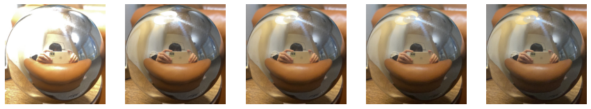

### Sample LDR Images

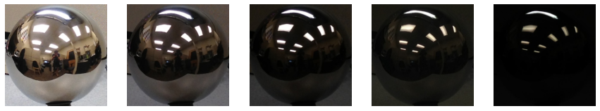

### Naive HDR merging

#### My Naive HDR merging

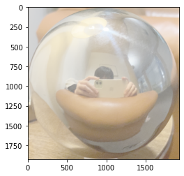

#### Sample Naive HDR merging

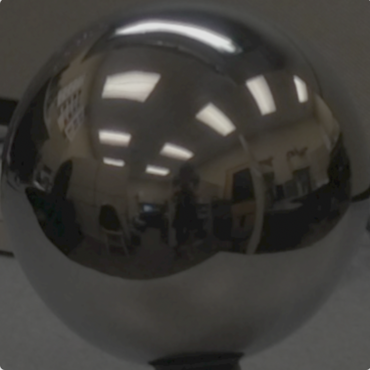

### Weighted HDR merging

#### My Weighted HDR merging

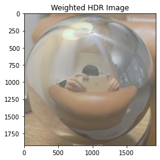

#### Sample Weighted HDR merging

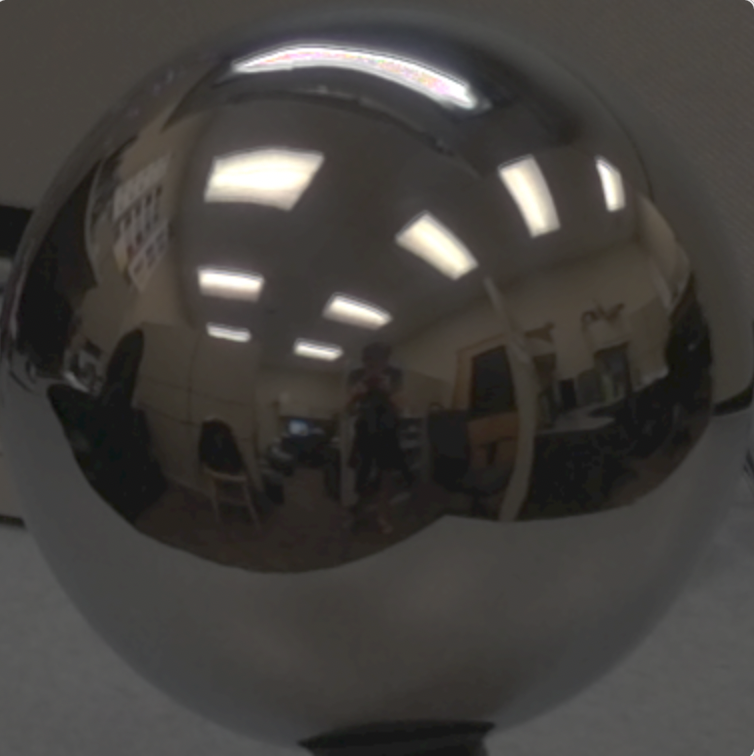

### Calibrated HDR merging

#### My Calibrated HDR merging

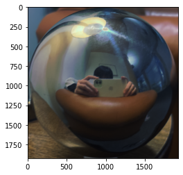

#### Sample Calibrated HDR merging

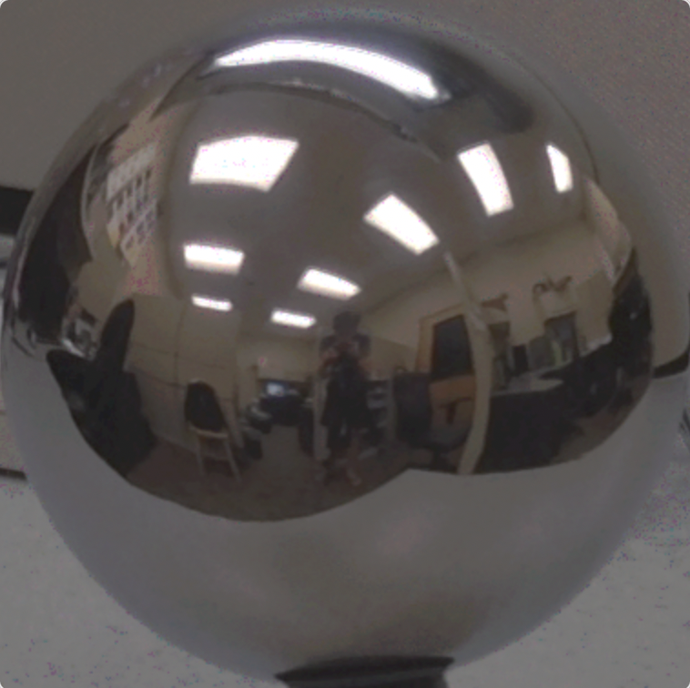

#### Plots of G vs. Intensity and Intensity vs. G

#### My image graphs

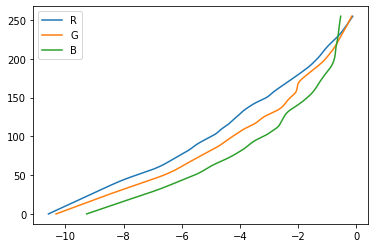

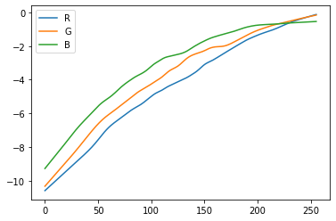

#### Sample image graphs

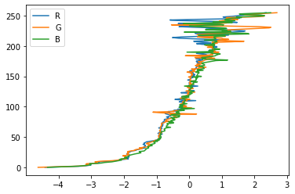

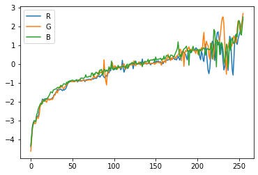

### Comparison & Error

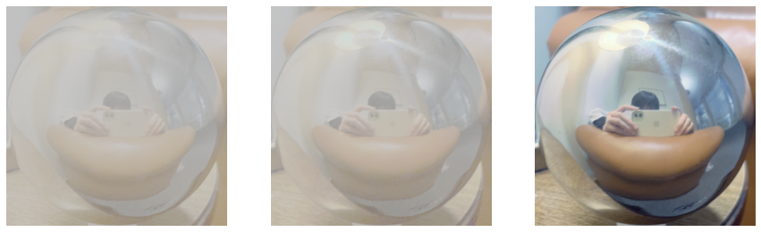

|     Naive      |    Log Range=6.122     |   AVG RMS Error = 0.799   |
| :------------: | :--------------------: | :-----------------------: |
|  **WEIGHTED**  | **LOG RANGE = 6.387**  | **AVG RMS ERROR = 0.81**  |
| **CALIBRATED** | **LOG RANGE = 10.696** | **AVG RMS ERROR = 0.589** |

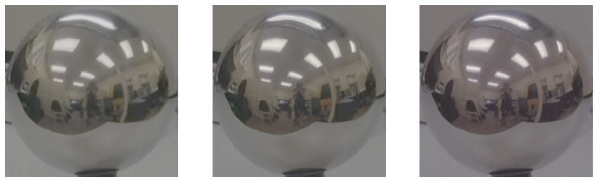

|     Naive      |   Log Range=6.464    |   AVG RMS Error= 0.324   |
| :------------: | :------------------: | :----------------------: |
|  **WEIGHTED**  | **LOG RANGE= 6.622** | **AVG RMS ERROR= 0.286** |
| **CALIBRATED** | **LOG RANGE= 7.002** | **AVG RMS ERROR= 0.255** |

### Panoramic transformations

#### My Panoramic

##### Normal

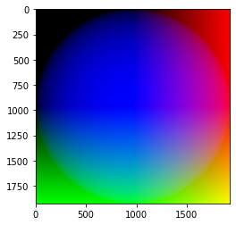

##### Reflection

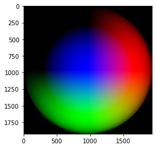

##### Final Result

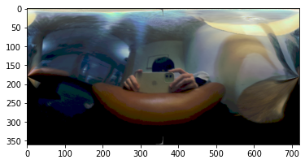

#### Sample Panoramic

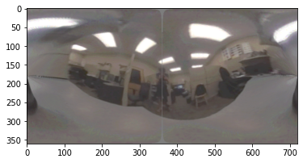

### Blender

#### Background

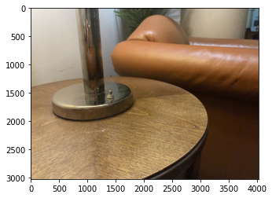

#### Mask

#### With Object Image

#### With out object image

#### Final Result

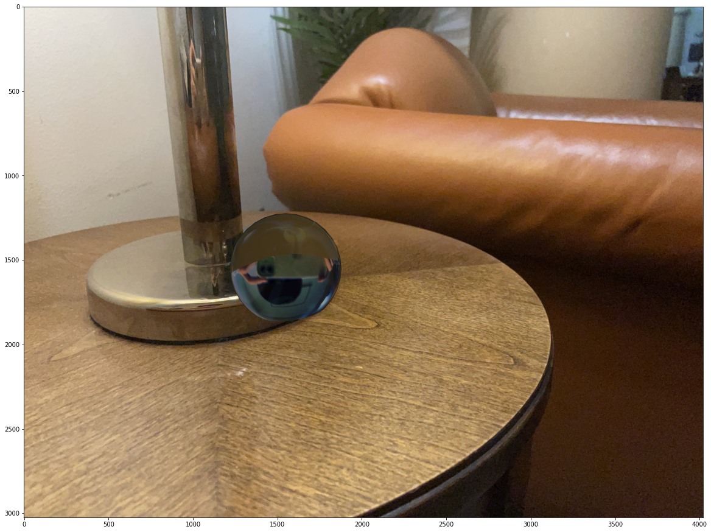

